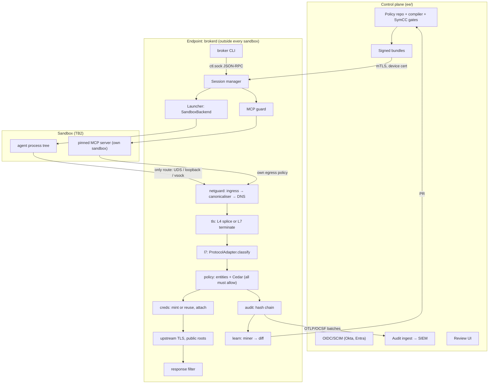
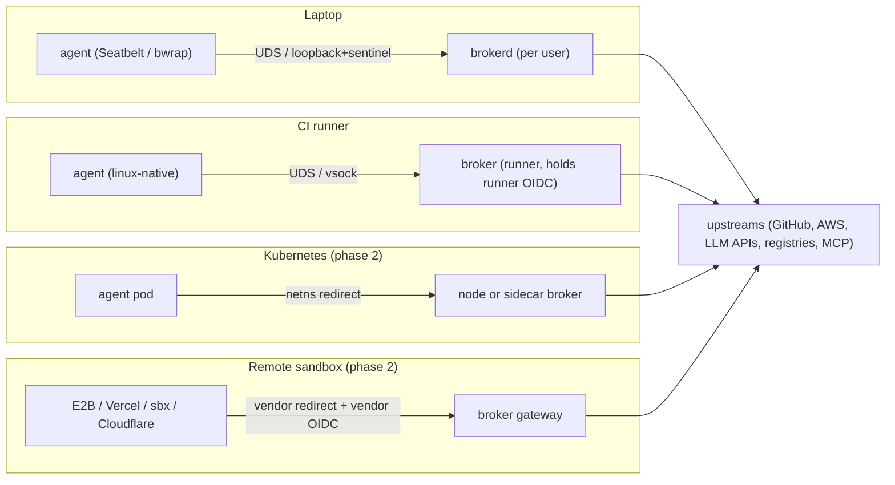

# Architecture Overview

> One Rust binary across three planes (control plane, endpoint data plane, learning plane), the component diagram, and the four deployment modes: laptop daemon, CI, Kubernetes (phase 2) and remote-sandbox gateway (phase 2).

## Summary

**Proposal.** The product is a single Apache-2.0 Rust binary (`broker` CLI plus the per-user `brokerd` daemon) that runs any coding agent or local MCP server under the OS sandbox vendors already ship, and makes the broker's own proxy the **only** way out. The proxy canonicalises, resolves, optionally terminates TLS, classifies each request into Cedar requests, and only if all allow does it mint and attach a short-lived upstream credential and append a hash-chained audit event. Around this **endpoint data plane** sit a commercial **control plane** (`ee/`: signed policy bundles, identity, audit ingest, review UI) and a **learning plane** that turns audit-mode traces into reviewable, SymCC-gated Cedar diffs ([[Policy Learning Loop]]).

The design splits responsibility the way the evidence suggests: isolation is borrowed (Seatbelt; bubblewrap with no network interface plus seccomp and Landlock, as srt and Codex already do ([srt](https://github.com/anthropic-experimental/sandbox-runtime); [codex](https://raw.githubusercontent.com/openai/codex/main/codex-rs/linux-sandbox/README.md))), and value lives in the broker: policy, minting, protocol semantics, audit and learning ([[ADR-001 Value Lives in the Broker]]).

## Responsibility of the architecture

The architecture as a whole must deliver the nine invariants (the table in [[MOC Architecture]]). Concretely:

- **Remove ambient authority** (TB2): the agent process tree runs with no secrets, no raw network, and kernel-enforced filesystem limits ([[Sandbox Launcher]], [[Two-Tier Isolation Design]]).
- **Hand back exactly the authority a task needs** (TB3 → TB4): capability requests cross the sandbox–broker channel; real credentials are attached only at the broker ([[Trust Boundaries]]).
- **Leave evidence outside the agent's reach** ([[I9 Hash-Chained Audit Outside the Sandbox]]).

**It must never:** give the sandbox a network route that bypasses the broker (topology, not `HTTP_PROXY`, [[Topology-Forced Egress]]); run an agent when any layer is missing ([[I2 Fail-Closed Launch]]); install its CA into the host trust store; forward a user's IdP token as-is to an upstream or MCP server; let any flag disable isolation, egress or brokering ([[I8 No Flag Disables Isolation]]).

## The three planes

| Plane | Runs where | Components | Licence |
|---|---|---|---|
| Endpoint data plane | laptop, CI runner, K8s node (phase 2), gateway host (phase 2) | `broker-cli`, `brokerd`, `launcher`, `netguard`, `tls`, `l7` adapters, `creds`, `policy`, `audit`, `mcpguard`, `grant` | Apache-2.0 |
| Control plane | SaaS or self-host | policy repo → compiler + SymCC gates → signed bundles; OIDC/SCIM; issuer config; audit ingest → SIEM; review UI; fleet inventory ([[Control Plane and Policy Bundles]]) | commercial `ee/` |
| Learning plane | local (`learn` crate) and hosted at scale | trace aggregation, generaliser, risk classifier, Cedar diff, gates, PR ([[Policy Learning Loop]]) | local Apache-2.0; hosted miner in `ee/` |

## Component diagram

Verbatim from the report (**Proposal**):

```
┌──────────────── Control plane (self-host or SaaS, ee/) ───────────────────────────────┐
│ Policy repo (git) → compiler + SymCC gates → signed bundles │ OIDC/SCIM (Okta, Entra)  │
│ Issuer config (GitHub App keys, AWS roles, OAuth clients)   │ Audit ingest → SIEM      │
│ Review UI (learned diffs, approvals)                         │ Fleet inventory          │
└──────────▲ bundles (mTLS, device cert)            ▲ audit batches (OTLP/OCSF)  ▲ PRs ───┘
┌── Endpoint: laptop / CI runner / K8s node ────────┴────────────────────────────┴────────┐
│ broker CLI ──ctl.sock (JSON-RPC, peer-cred checked, unreachable from sandbox)── brokerd │
│   Launcher: SandboxBackend {macos-seatbelt | linux-native | container | vm}             │
│      └─► agent process tree ── only route: data.sock / localhost:port / vsock ──┐       │
│   MCP guard: pinned stdio servers, each in its own sandbox as its own principal ─┤       │
│                                                                                  ▼       │
│   netguard: ingress (CONNECT | SOCKS5 | transparent) → canonicaliser → DNS policy        │
│   tls: per-session CA → leaf certs      l7: HTTP/1.1, h2 → ProtocolAdapter               │
│   policy: entity builder + Cedar authorize (all derived requests must allow)             │
│   creds: CredentialIssuer {static | github_app | aws_sts | oauth_exchange | vault}       │
│          → attach (header, SigV4) → upstream TLS (public roots) → response filter        │
│   audit: SQLite WAL, hash chain → OTLP/OCSF exporter      learn: traces → miner → diff   │
└──────────────────────────────────────────────────────────────────────────────────────────┘
```

The same structure as a graph, with the note that specifies each box:



## Components and where each is specified

| Crate (see [[Repository Layout]]) | Role | Note |
|---|---|---|
| `broker-cli`, `brokerd` | CLI, session manager, control socket, bundle sync, keychain | [[Broker CLI and Daemon]] |
| `launcher` | `SandboxBackend` per platform; compiles `fs.*` grants; fails closed | [[Sandbox Launcher]] |
| `netguard` | ingress listeners, single canonicaliser, broker DNS | [[Netguard Ingress]], [[Hostname Canonicaliser]], [[Broker DNS Resolver]] |
| `tls`, `l7` | per-session CA, L4/L7 path choice, h1/h2 pipeline, adapters | [[TLS Termination and Per-Session CA]], [[Git Smart-HTTP Adapter]], [[GitHub API Adapter]], [[Registry and LLM API Adapters]] |
| `policy` | entity builder, Cedar authorize, TOML compiler, exporters | [[Policy Engine and Entity Builder]] |
| `creds` | sentinel store, `CredentialIssuer` implementations | [[Credential Injector and Issuers]] |
| `audit` | hash-chained SQLite, OCSF/OTLP export | [[Audit Recorder and Event Schema]] |
| `mcpguard` | pinned MCP servers as principals | [[MCP Guard]] |
| `grant` | Txn-Token-shaped grant JWT across hosts | [[Internal Grant JWT]] |
| `learn` | record → mine → diff | [[Policy Learning Loop]] |

The crates meet at four traits ([[Core Trait Contracts]]): `SandboxBackend`, `ProtocolAdapter`, `CredentialIssuer`, `Recorder`. The split copies SafeYolo's separation of "service-route validation, credential selection, policy evaluation, inspection and injection" ([SafeYolo #620](https://github.com/craigbalding/safeyolo/issues/620)).

## Interfaces between planes

**Proposal; not compiled.** The endpoint exposes exactly three external surfaces:

```text
ctl.sock        JSON-RPC 2.0, per-user UDS, 0600, peer-cred checked (CLI → brokerd only)
data channel    UDS data.sock | loopback port + sentinel Proxy-Authorization | vsock (sandbox → broker only)
control plane   bundles pulled over mTLS with a device cert; audit pushed as OTLP/OCSF batches;
                learned diffs opened as PRs on the customer's policy repo
```

Configuration keys that select the plane wiring (**Proposal**, org or user layer only):

```toml
[deployment]
mode = "laptop"                  # laptop | ci | k8s | gateway (k8s, gateway: phase 2)
control_plane = "https://cp.example/tenant/acme"   # optional; absent = local bundles only
bundle_max_age = "72h"           # offline limit; value illustrative, not in the record

[identity]
source = "oidc_device"           # oidc_device | runner_oidc | k8s_sa_token | vendor_oidc
```

## Main flows at a glance

Full sequence diagrams and step-by-step walkthroughs are in [[Request and Session Lifecycle]]; this is the map.

1. **Session start.** `broker run -- claude` → `session.start` → identity, agent hash, repo remote → Task entity from the active bundle plus approved narrowing repo policy → per-session CA and sentinels → listeners → `probe()` → `launch()`; any failure refuses launch.
2. **Egress with minting.** Request → canonicaliser → broker DNS → L4 splice or L7 terminate → adapter classifies into Cedar requests (for example `http.POST` on a `PathPrefix` plus `credential.use`) → all allow → mint or reuse per scope digest → attach → verified upstream TLS → response filter → audit append.
3. **git push.** SSH remotes rewritten to HTTPS; receive-pack pkt-lines become one `git.push` per ref; any denied ref denies the push; a repo-scoped installation token is attached ([[Git Smart-HTTP Adapter]]).
4. **MCP tool call.** The agent names a pinned server via `broker mcp connect <name>`; `brokerd` launches the pinned command in its own sandbox; `tools/list` is hash-pinned; each `tools/call` is authorized with its arguments ([[MCP Guard]]).
5. **Deny and audit.** Any parse failure, unmatched L7 request, Cedar deny, foreign credential or audit failure denies; the deny is logged with a reason and explained by `broker why`.
6. **Policy learning.** Audit mode records would-be decisions; the miner emits a Cedar diff; SymCC gates run; a human approves a PR; the new bundle runs in shadow before enforcing.

## Deployment modes

From the report's deployment table and research note 05 §3.6 (**Proposal**):

| Mode | Shape | Identity source | Channel to broker | Grant form | Milestone |
|---|---|---|---|---|---|
| Laptop | launchd or systemd user daemon; per-user CA key in the OS keychain, never in the system trust store | OIDC device login to Okta or Entra | UDS (Linux), loopback port + sentinel (macOS), vsock (VM tier) | Cedar entity data in `brokerd` | M0–M3 |
| CI | GitHub Action `setup` step (`broker/setup@v1` in research note 05) runs `broker run -- <agent>`; broker outside the sandbox in the runner; job secrets never enter the agent tree | Runner OIDC JWT exchanged for a session grant | UDS, or vsock in a VM | entity data; [[Internal Grant JWT]] if broker runs as a separate sidecar | M3 |
| Kubernetes (phase 2) | Node or sidecar broker; pod netns rules; mutating webhook; integration with Agent Sandbox `SandboxTemplate` ([kubernetes-sigs/agent-sandbox](https://github.com/kubernetes-sigs/agent-sandbox)) | Projected service-account token | pod netns redirect to the broker | [[Internal Grant JWT]] | phase 2 |
| Remote sandbox gateway (phase 2) | Broker as upstream proxy for E2B, Vercel `forwardURL`, Docker sbx and Cloudflare outbound handlers | Vendor OIDC, for example Vercel's `vercel-sandbox-oidc-token` ([Vercel docs](https://vercel.com/docs/sandbox/concepts/firewall)) | vendor host-side transparent redirect ([Vercel](https://vercel.com/blog/a-sandbox-without-a-network-boundary-is-only-half-a-sandbox); [Cloudflare](https://blog.cloudflare.com/sandbox-auth/)) | [[Internal Grant JWT]] | phase 2 |



In every mode the broker sits outside the isolation boundary, and in every mode the sandbox's only route is the broker; the modes differ in where identity comes from and whether the grant must travel as a token.

> [!warning] Conflict
> The laptop row keeps a "per-user CA key in the OS keychain", while the L7 path and the lifecycle specify a per-session CA destroyed at session end. The resolution proposed in [[TLS Termination and Per-Session CA]] (a keychain key may only sign per-session CAs and is never trusted by the sandbox) applies here too.

## Internal design principles

**Proposal.**

- **One process owns authority.** `brokerd` holds CA keys, sentinels, minted tokens, the Cedar engine and the audit writer in one address space; nothing else on the host needs secrets.
- **Default deny at every stage.** Empty lists deny, unknown hosts deny, unmatched L7 requests deny, unparseable input denies ([[CLAUDE]] working rules).
- **L4 by default, L7 only where credentials or verbs matter** ([[TLS Termination and Per-Session CA]]).
- **One canonicaliser** feeds every decision ([[I6 Single Canonicaliser]]).
- **Write-ahead audit**: the event is durable before the decision takes effect.

## State

| State | Owner | Lifetime |
|---|---|---|
| Sessions, CA keys, sentinels, minted tokens, trifecta labels | `brokerd` memory | session |
| Audit chain, traces, token metadata, approvals, bundle cache | per-user state dir (SQLite WAL) | retention |
| Credential roots | Keychain or libsecret | persistent |
| Fleet policy, audit copies, inventory | control plane (Postgres) | tenant retention |

## Failure modes and fail-closed behaviour

- Any layer, listener, CA or bundle missing at start: no launch ([[I2 Fail-Closed Launch]]). Claude Code by contrast warns and runs unsandboxed unless `sandbox.failIfUnavailable` is set ([Claude Code docs](https://code.claude.com/docs/en/sandboxing)).
- `brokerd` crash: the sandbox's only route is dead, so egress stops.
- Control plane unreachable: last-known-good bundle until max age, then refuse new sessions.
- Audit write failure: deny.

## Security considerations

- The custom proxy is the attack surface. Anthropic's own custom proxy "repeatedly introduced vulnerabilities" ([Anthropic](https://www.anthropic.com/engineering/how-we-contain-claude)); keep the L7 surface minimal, fuzz every parser, publish the bypass corpus ([[Conformance Probe Matrix]]).
- The broker concentrates credentials (the honeypot risk): per-user daemon, keychain-held roots, memory-only minted tokens with short TTLs, and a control socket unreachable from sandboxes.
- Non-goal: misuse of authority legitimately granted to the task ([[Threat Model Non-Goals]]).

## Performance budget

From [[L4 Product Metrics]]: warm-connection added latency p50 ≤5 ms, p95 ≤25 ms; new terminated connection p50 ≤15 ms; ≤5% added wall-clock per task; sandbox start ≤150 ms on native backends. These are proposals to measure against on reference machines, not sourced facts.

## Invariants upheld

All nine; the allocation of each invariant to crates is in [[Core Trait Contracts]] and the invariant notes. The topology (I1 network half, I2), the single canonicaliser (I6) and the out-of-sandbox chain (I9) are architectural rather than component-local.

## Test plan

- **E2E matrix:** real agents (Claude Code, Codex, Gemini CLI, Cursor agent) × macOS and Linux versions, scripted "fix failing test" tasks ([[M0 Contained Run]]).
- **Conformance:** all twelve probe categories, run per deployment mode as each mode lands ([[Conformance Probe Matrix]]).
- **Property:** for random session configurations, the set of reachable network endpoints from inside the sandbox is exactly `{spec.egress}`.
- **Fuzz:** every parser on the path (canonicaliser, CONNECT, SOCKS5, SNI peek, h1, h2, pkt-line, JSON-RPC).
- **Deployment probes:** in CI mode, scan the agent tree for runner secrets; in gateway mode, replay a grant JWT from another sandbox (must fail).

## Crates

All workspace crates listed above; external dependencies per [[Tech Stack]] (tokio, hyper 1.x, rustls, rcgen, `cedar-policy`, `landlock`, `rusqlite`, `opentelemetry`). Crate maturity beyond `hudsucker` and `landlock` is unverified ([[Open Questions and Unverified Claims]]).

## Delivering milestone

The skeleton, traits, launcher, netguard and minimal recorder land in [[M0 Contained Run]]; each later milestone adds implementations, not new seams ([[MVP Plan]]). Kubernetes and gateway modes are phase 2.

## How it connects

- part-of:: [[Repository Layout]]
- depends-on:: [[Broker CLI and Daemon]]
- depends-on:: [[Sandbox Launcher]]
- depends-on:: [[Netguard Ingress]]
- depends-on:: [[TLS Termination and Per-Session CA]]
- depends-on:: [[Policy Engine and Entity Builder]]
- depends-on:: [[Credential Injector and Issuers]]
- depends-on:: [[Audit Recorder and Event Schema]]
- depends-on:: [[Control Plane and Policy Bundles]]
- depends-on:: [[MCP Guard]]
- depends-on:: [[Policy Learning Loop]]
- implements:: [[Topology-Forced Egress]]
- implements:: [[Trust Boundaries]]
- contrasts-with:: [[Cloud Sandbox Runtimes]]
- evaluated-by:: [[Conformance Probe Matrix]]
- evaluated-by:: [[L4 Product Metrics]]
- delivered-by:: [[M0 Contained Run]]
- decided-by:: [[ADR-001 Value Lives in the Broker]]
- decided-by:: [[ADR-015 Rust for the Endpoint and Custom Proxy]]

Flows are specified in [[Request and Session Lifecycle]]; cross-host grants in [[Internal Grant JWT]].

## Implications for the build

- Create the full workspace and the four traits in M0 even though most crates are stubs; later milestones fill implementations behind fixed seams.
- Treat deployment mode as configuration of identity source and channel, not as separate code paths through the decision pipeline: the same `policy`, `creds` and `audit` code runs in every mode.
- Every new component note must say which plane it lives in and which trust boundary it enforces.

## Open questions

- Transparent interception on macOS without a Network Extension is unvalidated; clients that ignore proxy variables fail closed ([[Open Questions and Unverified Claims]]).
- Per-user keychain CA versus per-session CA (conflict above).
- Kubernetes: node-level broker versus sidecar, and how pod netns rules are installed without privileged init containers, is not in the record.
- Whether agent vendors will expose stable egress hooks, versus wrapping the process, is unknown (report risk table).

## Sources

- https://github.com/anthropic-experimental/sandbox-runtime
- https://raw.githubusercontent.com/openai/codex/main/codex-rs/linux-sandbox/README.md
- https://vercel.com/blog/a-sandbox-without-a-network-boundary-is-only-half-a-sandbox
- https://vercel.com/docs/sandbox/concepts/firewall
- https://blog.cloudflare.com/sandbox-auth/
- https://github.com/kubernetes-sigs/agent-sandbox
- https://www.anthropic.com/engineering/how-we-contain-claude
- https://code.claude.com/docs/en/sandboxing
- https://github.com/craigbalding/safeyolo/issues/620
- Report: "Reference architecture: one Rust binary across three planes (Proposal)" (component diagram verbatim, request life, deployment modes, tech stack); research note 05 §3 takeaway, §3.1 and §3.6.
