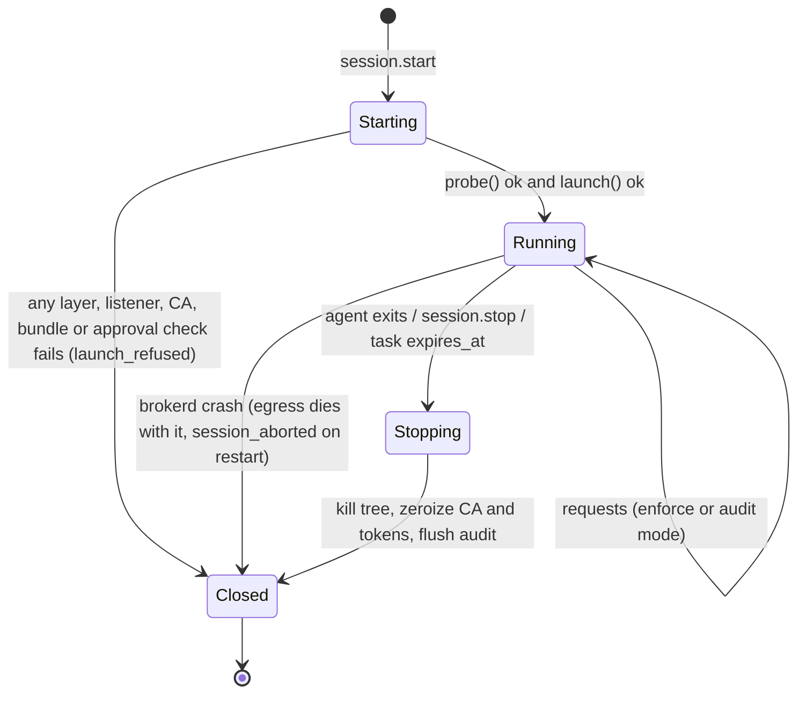
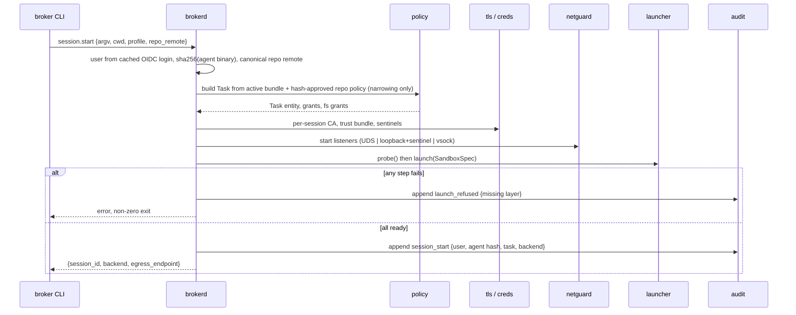
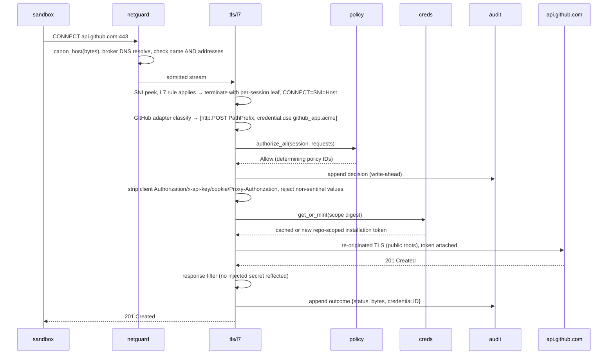
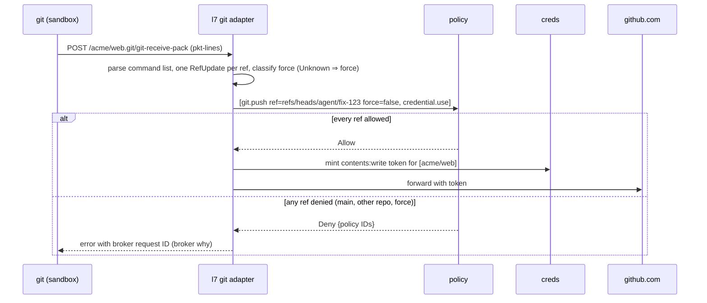
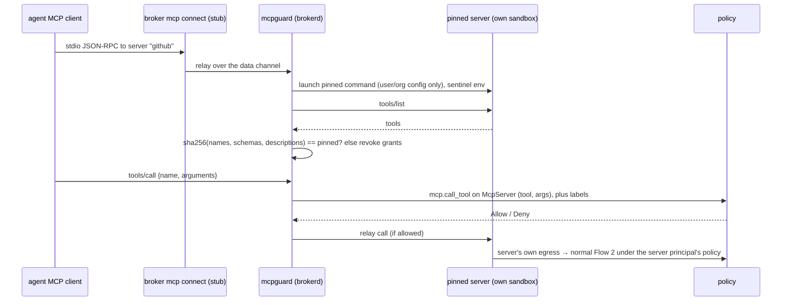
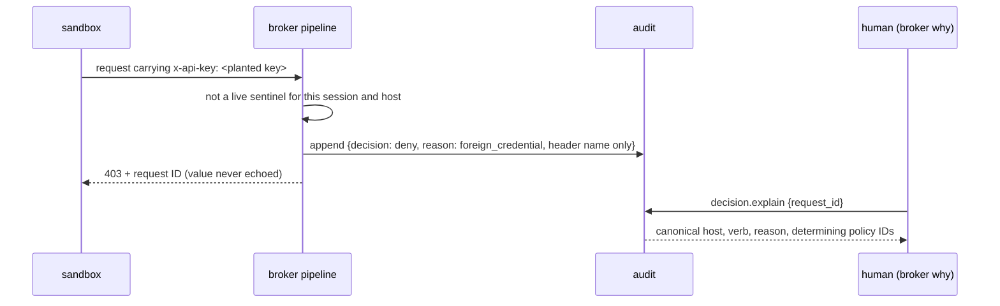
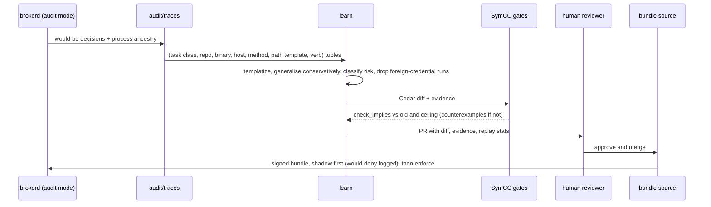

# Request and Session Lifecycle

> The six-step life of a session and its requests: session.start resolves user, agent hash and repo into a Task entity; CA, sentinels and sandbox rules are compiled; each request is canonicalised, resolved, optionally terminated and classified; all Cedar requests must allow before minting and attach; response filter and audit append; teardown destroys the CA and cached tokens.

## Summary

This note is the data-flow contract that every component note plugs into. It fixes the **order** of operations, because order is where the security properties live: canonicalise before resolve, authorize before strip-and-inject, audit before forward, destroy at teardown. Component internals are in the linked notes; the placement of each component is in [[Architecture Overview]]. **Proposal:** the sequence diagrams and walkthroughs below elaborate the report's six steps; message names, reasons and status codes are design defaults, not sourced facts.

## The six steps (report, **Proposal**)

Copied faithfully from the report's "A request's life runs as follows":

1. `broker run -- claude` asks `brokerd` over the control socket to start a session. `brokerd` resolves the user from a cached OIDC login, identifies the agent binary by hash, reads the repo remote, and computes the Task entity and its grants from the active bundle plus any narrowing repo policy.
2. It generates the per-session CA and sentinels, compiles the filesystem grants into SBPL or bwrap, Landlock and seccomp rules, and launches the agent.
3. Each outbound request passes the canonicaliser and DNS policy, then TLS termination if an L7 rule or credential applies. A protocol adapter classifies the request into one or more Cedar requests, for example `http.POST` on a PathPrefix plus `credential.use` on the GitHub credential.
4. Only if all of them allow does the issuer mint or reuse a cached token for that scope digest and attach it.
5. The response filter runs, and the decision, request metadata (redacted URL, method, bytes, status) and credential ID (never the value) are appended to the hash-chained log.
6. At session end, the broker destroys the CA, drops the cached tokens and flushes the audit log.

## Responsibility and what the flow must never do

Owned jointly by [[Broker CLI and Daemon]] (session) and the `netguard` → `tls`/`l7` → `policy` → `creds` → `audit` pipeline (request).

**It must never:** launch before every layer and listener is ready ([[I2 Fail-Closed Launch]]); load repo policy before content-hash approval or let it widen ([[I4 Repo Policy Only Narrows]], [[I5 Config Outside Writable Mounts]]); resolve or connect before canonicalisation ([[I6 Single Canonicaliser]]); mint before every derived Cedar request allowed; forward a client credential ([[I7 Reject Foreign Credentials]]); forward before the audit append is durable ([[I9 Hash-Chained Audit Outside the Sandbox]]); leave CA keys or tokens alive after teardown ([[I1 No Secrets in the Sandbox]]).

## Session state machine

**Proposal; not compiled.**



```rust
pub enum SessionState { Starting, Running, Stopping, Closed }
pub struct Session {
    pub id: SessionId, pub task: TaskRef, pub mode: Mode,           // Enforce | Audit
    pub labels: SessionLabels,                                       // monotone (Trifecta Session Labels)
    pub ca: tls::SessionCa, pub sentinels: creds::SentinelStore,
    pub tokens: creds::TokenCache,                                   // keyed by scope digest
    pub backend: SandboxHandle, pub listeners: netguard::Listeners,
}
```

## Flow 1: session start (steps 1–2)



**Walkthrough.** Repo policy files (`.broker/*`) are read by `brokerd`, not the agent, and only when their hash is approved; the Task's `repo` and `branch_prefix` come from the canonical remote, so later adapters compare against canonical values. The `SandboxSpec.env` holds only allowlisted variables, sentinels and CA-bundle variables ([[Sandbox Launcher]]).

## Flow 2: egress request with credential minting (steps 3–5)

Example: the agent opens a PR with `POST https://api.github.com/repos/acme/web/pulls`.



**Walkthrough.** If the host has no credential or L7 rule, the connection takes the L4 fast path after the SNI peek and no credential is ever attached. A `github_app` mint always sets `repositories` and `permissions`, because omitting them gives the token the whole installation ([GitHub REST](https://docs.github.com/en/rest/apps/apps#create-an-installation-access-token-for-an-app)). The GitHub adapter also reads repository visibility from responses and may flip `sensitive_read` ([[Trifecta Session Labels]]).

## Flow 3: git push



**Walkthrough.** SSH remotes are rewritten to HTTPS by a broker-generated git config and port 22 is denied, so every push takes this path ([[Git Smart-HTTP Adapter]]). One denied ref denies the whole push. With `untrusted_input` and `sensitive_read` both set, the Rule of Two forbid makes the push need approval; the prompt shows an authority diff, not prose ([[Fatigue-Resistant Approval Interfaces]]).

## Flow 4: MCP tool call



**Walkthrough.** The server's upstream API calls carry sentinels that the broker swaps only on egress; the stdio exemption in the MCP spec ("retrieve credentials from the environment") is neutralised without modifying the server ([MCP Authorization](https://modelcontextprotocol.io/specification/latest/basic/authorization)). A changed description revokes the server's grants until re-approval, the rug-pull mitigation ([Invariant Labs](https://invariantlabs.ai/blog/mcp-security-notification-tool-poisoning-attacks)); see [[MCP Guard]].

## Flow 5: deny and audit

**Proposal.** Every stage can deny; each deny is one audit event with a machine-readable reason, and the sandbox sees a broker error carrying the request ID, never policy text or secret values.

| Stage | Example reason | Sandbox sees |
|---|---|---|
| canonicaliser | `forbidden_byte`, `ip_literal`, `metadata_addr` | CONNECT 403 / SOCKS failure |
| DNS | `name_not_allowed` | NXDOMAIN-equivalent |
| TLS path | `sni_less`, `connect_sni_mismatch` | connection closed |
| adapter | `parse_error`, `empty_classification` | HTTP 403 with request ID |
| policy | `cedar_deny` + policy IDs | HTTP 403 with request ID |
| credentials | `foreign_credential`, `mint_failed` | HTTP 403 with request ID |
| audit | `audit_unavailable` | HTTP 503 with request ID |



This reproduces the Cowork lesson: a proxy that "only passes requests carrying the VM's own provisioned session token; an attacker-embedded key is rejected" ([Anthropic](https://www.anthropic.com/engineering/how-we-contain-claude)).

## Flow 6: policy learning



An LLM may explain the diff but never merge it; gates use `cedar-policy-symcc` queries ([docs.rs](https://docs.rs/cedar-policy-symcc)); details in [[Policy Learning Loop]] and [[SymCC CI Gates]].

## Deployment-mode variations

| Step | Laptop | CI | Kubernetes (phase 2) | Gateway (phase 2) |
|---|---|---|---|---|
| 1 identity | cached OIDC device login | runner OIDC JWT exchanged for a session grant | projected service-account token | vendor OIDC, e.g. `vercel-sandbox-oidc-token` ([Vercel docs](https://vercel.com/docs/sandbox/concepts/firewall)) |
| 2 launch | local backend | linux-native in the runner, broker outside | pod netns rules via webhook | vendor sandbox; broker does not launch |
| 3 channel | UDS / loopback+sentinel | UDS / vsock | netns redirect | vendor transparent redirect |
| grant form | Cedar entity data | entity data, or [[Internal Grant JWT]] if split hosts | [[Internal Grant JWT]] | [[Internal Grant JWT]], DPoP-bound |
| 6 teardown | session end | job end | pod end | vendor sandbox stop |

## State

Per session: the `Session` struct above (memory only). Per request: buffered head and bounded body, derived `AuthzRequest`s, decision, credential ID. Durable: audit rows and traces only.

## Failure modes and fail-closed behaviour

- Step 1–2: any error → `Closed`, `launch_refused`, non-zero exit.
- Step 3: canonicalise, resolve, parse or classify error → deny.
- Step 4: any Cedar deny or evaluation error → deny; mint error → deny, never forward without the credential.
- Step 5: audit append error → deny; response-filter hit → the response is not relayed as is (**Proposal:** replace body with a broker error and log `secret_reflected`).
- Step 6: teardown runs on every exit path, including `brokerd` restart (orphaned sandboxes killed).

## Security considerations

- Time-of-check versus time-of-use: authorization, stripping and injection act on the same parsed, re-serialised request, never re-read raw bytes.
- h2 streams and redirects are separate requests that go through steps 3–5 each; cross-origin hops lose credentials.
- Labels are read at authorization time and written after the response; a request's decision uses labels as of its start.

## Performance budget

Steps 3–5 must fit warm p50 ≤5 ms, p95 ≤25 ms and new terminated p50 ≤15 ms; steps 1–2 fit sandbox start ≤150 ms native ([[L4 Product Metrics]]). Cedar median authorization is 4.0–11.0 µs per request (see [[Policy Engine and Entity Builder]]), so the budget is dominated by TLS and upstream I/O.

## Invariants upheld

I1 (steps 2, 5, 6), I2 (steps 1–2), I4 and I5 (step 1), I6 (step 3), I7 (step 4 strip-and-reject), I9 (step 5 and every deny).

## Test plan

- **Order tests:** instrumented pipeline asserting canonicalise < resolve < authorize < strip < mint < forward, and audit-durable < forward.
- **Property:** decision equals the conjunction of adapter requests; no mint call without a prior allow for `credential.use`.
- **Fault injection:** each step fails in turn; nothing reaches the upstream echo server.
- **Teardown:** after `session.stop`, memory scan of `brokerd` finds no CA key or token bytes for the session; a replayed sentinel is rejected.
- **E2E:** acceptance scripts of [[M0 Contained Run]], [[M1 Secrets Outside]], [[M2 Policy Audit and Learn]], [[M3 CI Identity and MCP]]; conformance categories in [[Conformance Probe Matrix]].

## Crates

`brokerd` (session), `launcher`, `netguard`, `tls`, `l7`, `policy`, `creds`, `audit`, `mcpguard`, `learn`, `grant` ([[Core Trait Contracts]]).

## Delivering milestone

Steps 1–3 and a minimal step 5 in M0; L7, minting and step 4 in M1; Cedar, chain and learning in M2; CI identity, MCP and grant JWT in M3.

## How it connects

- part-of:: [[Architecture Overview]]
- depends-on:: [[Broker CLI and Daemon]]
- depends-on:: [[Sandbox Launcher]]
- depends-on:: [[Netguard Ingress]]
- depends-on:: [[TLS Termination and Per-Session CA]]
- depends-on:: [[Policy Engine and Entity Builder]]
- depends-on:: [[Credential Injector and Issuers]]
- depends-on:: [[Audit Recorder and Event Schema]]
- implements:: [[Just-in-Time Credential Minting]]
- implements:: [[I4 Repo Policy Only Narrows]]
- evaluated-by:: [[Conformance Probe Matrix]]
- evaluated-by:: [[L4 Product Metrics]]
- delivered-by:: [[M0 Contained Run]]
- delivered-by:: [[M1 Secrets Outside]]
- delivered-by:: [[M2 Policy Audit and Learn]]
- delivered-by:: [[M3 CI Identity and MCP]]

## Implications for the build

- Encode the step order in one pipeline function per path (L4, L7, MCP) so reviewers can check order in one place; adapters and issuers never call each other.
- Deny reasons are an enumerated type shared by `netguard`, `l7`, `policy`, `creds` and `audit`; `broker why` renders them.
- Teardown is a destructor on `Session`, tested with a zeroization check.

## Open questions

- Upstream revocation of minted tokens at teardown (GitHub, AWS) is not covered by the record.
- Whether an in-flight request may complete after `Stopping` begins (proposal: no; cancel and log).
- HTTP status and body format for denies across clients (403 versus a custom code) needs compatibility testing ([[Open Questions and Unverified Claims]]).

## Sources

- https://www.anthropic.com/engineering/how-we-contain-claude
- https://docs.github.com/en/rest/apps/apps#create-an-installation-access-token-for-an-app
- https://modelcontextprotocol.io/specification/latest/basic/authorization
- https://invariantlabs.ai/blog/mcp-security-notification-tool-poisoning-attacks
- https://vercel.com/docs/sandbox/concepts/firewall
- https://docs.rs/cedar-policy-symcc
- Report: "A request's life runs as follows" (six steps, verbatim), "Interfaces", "Deployment modes", "MCP guard", "Least-privilege learning"; research note 05 §3.1 diagram flow and §3.4.
